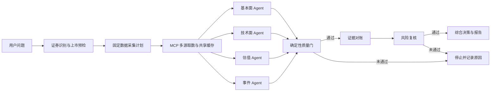
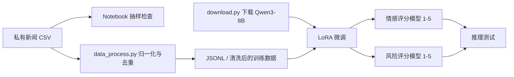

# Finance MCP Agent

一个面向金融研究的实验性项目，主要包含两条工作流：

1. **A 股多智能体分析**：通过 MCP 聚合公开市场数据，使用 LangGraph 编排基本面、技术面、估值和事件分析 Agent，经过质量门、风险复核后生成综合报告。
2. **新闻情感与风险模型实验**：清洗新闻数据，并基于 Qwen3-8B 使用 LoRA 微调情感评分与风险评分模型。

> 本项目仅用于技术研究和信息整理，不构成投资建议。市场数据可能延迟、不完整或存在供应商差异，请在实际决策前自行核验。

## 核心功能

- 从公司名称或股票代码识别并预检 A 股上市证券。
- 通过本地 MCP Server 统一访问行情、财务、估值、公告、新闻和宏观数据。
- 并行执行基本面、技术面、估值和事件四类专业分析。
- 对证券范围、日期、OHLC、空数据和工具权限进行确定性校验。
- 使用共享缓存、调用预算、有限重试和供应商熔断降低延迟与异常扩散。
- 质量门未通过时停止生成综合结论，避免输出缺少证据的报告。
- 对通过质量门的结果执行证据对账、风险复核和最终决策汇总。
- 保存运行轨迹、工具调用和报告，便于复查与审计。
- 提供新闻去重、Qwen 模型下载、LoRA 训练和推理测试脚本。

## A 股分析流程



每次 Agent 工具调用还会经过以下网关：

```text
Agent 工具白名单
    -> MCP 执行器
    -> 证券范围与日期校验
    -> 数据质量校验
    -> 有限重试 / 熔断 / 调用预算
    -> 缓存与审计轨迹
```

### 数据来源分工

| 来源 | 主要用途 |
| --- | --- |
| Baostock | 证券身份、交易日历、财务数据和基础历史行情 |
| 腾讯行情 | 最新价格和行情交叉核验 |
| mootdx（可选） | 通达信 K 线备用核验 |
| 东方财富 | 估值、换手率和资金流特色指标 |
| 巨潮资讯、上交所、深交所 | 官方公告及交叉取数 |
| 财联社、新浪财经 | 财经新闻；新浪作为数量不足时的补充来源 |

## 项目结构

```text
Finance/
├─ Financial-MCP-Agent/          # LangGraph 多智能体主程序
│  ├─ src/main.py                # 单次查询与交互式 CLI 入口
│  ├─ src/workflow.py            # 统一工作流编排
│  ├─ src/agents/                # 专业分析、风险复核和决策 Agent
│  ├─ src/tools/                 # MCP 客户端、缓存、权限和数据质量层
│  ├─ src/utils/                 # 状态、日志、报告和辅助逻辑
│  └─ tests/                     # 主工作流单元测试
├─ a-share-mcp-is-just-i-need/   # A 股数据 MCP Server
│  ├─ mcp_server.py              # FastMCP stdio 服务入口
│  ├─ src/tools/                 # 行情、财务、公告、新闻等 MCP 工具
│  └─ tests/                     # MCP 工具与数据适配测试
├─ nasdaq_news_sentiment/        # 情感数据实验 notebook；原始 CSV 不入库
├─ risk_nasdaq/                  # 风险数据实验 notebook；原始 CSV 不入库
├─ data_process.py               # 新闻清洗与去重
├─ download.py                   # 下载 Qwen/Qwen3-8B
├─ train_qwen_sentiment.py       # 情感评分 LoRA 训练
├─ train_qwen_risk.py            # 风险评分 LoRA 训练
├─ test_qwen_sentiment.py        # 情感模型推理测试
├─ test_risk_model.py            # 风险模型推理测试
├─ requirements.txt              # 主工作流依赖
└─ requirements-mootdx.txt       # 可选 mootdx 依赖
```

## 环境要求

### A 股分析主程序

- 64 位 CPython **3.11**（推荐）。
- Conda 或其他独立虚拟环境；不建议把依赖安装到 Conda `base`。
- 可访问所使用的行情、公告、新闻和 LLM API 服务。
- 一个 OpenAI 兼容接口的 API Key、Base URL 和模型名称。
- Windows、Linux 或 macOS；示例命令以 PowerShell 为主。

主依赖由 `requirements.txt` 管理，包括：

- LangGraph、LangChain Core、LangChain OpenAI
- LangChain MCP Adapters、Pydantic
- Baostock
- Transformers、PEFT、Hugging Face Hub
- Rich、python-dotenv、uv

源码还直接使用 `pandas`、`numpy`、`requests`、`beautifulsoup4`、`backoff`、`google-genai`、`mcp` 和 `openai`。部分包可能由主依赖间接安装；为保证全新环境可运行，建议显式安装：

```powershell
python -m pip install pandas numpy requests beautifulsoup4 backoff google-genai mcp openai
```

### Qwen 训练实验

除主依赖外，还需要：

- PyTorch（根据 CPU/CUDA 环境选择对应构建）
- `datasets`、`accelerate`
- `scikit-learn`、`jieba`、`tqdm`
- 足够的磁盘、内存或显存来下载和加载 Qwen3-8B

```powershell
python -m pip install torch datasets accelerate scikit-learn jieba tqdm
```

## 快速开始

### 1. 创建环境

在项目根目录执行：

```powershell
conda create -n finance-agent python=3.11 -y
conda activate finance-agent

python -m pip install --upgrade pip
python -m pip install -r .\requirements.txt
python -m pip install pandas numpy requests beautifulsoup4 backoff google-genai mcp openai
python -m pip check
```

如果需要 mootdx 作为备用 K 线源，再执行：

```powershell
python -m pip install --no-deps -r .\requirements-mootdx.txt
python -c "from mootdx.quotes import Quotes; print('mootdx Quotes: OK')"
```

`--no-deps` 用于避免 `mootdx==0.11.7` 的旧版 `httpx`、`tenacity` 约束覆盖当前 MCP/LangChain 运行环境。不安装 mootdx 时，其他行情源仍可使用。

### 2. 配置 LLM

复制主程序的环境变量模板：

```powershell
Copy-Item .\Financial-MCP-Agent\.env.example .\Financial-MCP-Agent\.env
```

编辑 `Financial-MCP-Agent/.env`：

```dotenv
OPENAI_COMPATIBLE_API_KEY=your_api_key_here
OPENAI_COMPATIBLE_BASE_URL=https://your-api-endpoint.example/v1
OPENAI_COMPATIBLE_MODEL=your_model_name
USE_LOCAL_MODEL=api
```

主程序启动 MCP Server 时会使用同一个 Python 解释器，MCP 数据层也会回退读取 `Financial-MCP-Agent/.env`。如果单独运行 MCP Server，也可以从 `a-share-mcp-is-just-i-need/.env.example` 创建其本地 `.env`。

不要提交任何真实 `.env` 或 API Key；仓库的 `.gitignore` 已默认排除这些文件。

### 3. 运行分析

进入主程序目录：

```powershell
Set-Location .\Financial-MCP-Agent
```

执行一次完整分析：

```powershell
python -m src.main --command "全面分析贵州茅台 600519"
```

在终端显示完整分析内容：

```powershell
python -m src.main `
  --command "分析贵州茅台 600519 的基本面和技术走势" `
  --show-analysis-output
```

启动持续交互模式：

```powershell
python -m src.main
```

交互模式支持 `/help`、`/history`、`/clear`、`/verbose on`、`/verbose off`；输入 `退出`、`exit` 或 `quit` 结束。

### 4. 结构化或兼容入口

只执行专业分析并返回质量门后的结构化数据：

```powershell
python -m src.agent_loop_cli `
  --command "分析贵州茅台 600519 的基本面" `
  --company "贵州茅台" `
  --data-only
```

生成包含风险复核和综合决策的完整报告：

```powershell
python -m src.agent_loop_cli `
  --command "全面分析比亚迪 002594" `
  --symbol sz.002594 `
  --no-data-only
```

估值对比涉及其他证券时，需要使用可重复的 `--allowed-symbol` 显式授权同行代码。

## 输出与缓存

运行时会生成以下本地内容，它们已被 Git 忽略：

```text
Financial-MCP-Agent/reports/         # Markdown 分析报告
Financial-MCP-Agent/logs/            # 会话和 Agent 执行日志
Financial-MCP-Agent/logs/workflow/   # trace.jsonl、final_state.json 等审计文件
.cache/financial_mcp/                # 跨运行的金融数据缓存
```

缓存按数据类别设置 TTL，并支持历史区间复用和 stale-while-revalidate。日志可能包含完整用户问题、模型响应和工具参数，不应直接上传到公开仓库。

## 新闻数据与 Qwen 微调流程



下载基础模型：

```powershell
python .\download.py
```

默认保存到项目根目录的 `Qwen/`。模型文件很大，不应直接提交到 Git。

准备好私有 CSV 后，可以运行：

```powershell
python .\data_process.py
python .\train_qwen_sentiment.py
python .\train_qwen_risk.py
python .\test_qwen_sentiment.py
python .\test_risk_model.py
```

这些脚本目前属于实验代码，运行前必须检查并调整路径：

- 训练和测试脚本中的基础模型路径仍为 `/root/code/Finance/Qwen`。
- `data_process.py` 中存在 `/mnt/data/Finance/...` 输入路径。
- 训练数据默认文件名为 `sentiment_deepseek_new_cleaned_nasdaq_news_full.csv` 和 `risk_deepseek_cleaned_nasdaq_news_full.csv`。
- 训练脚本当前只读取前 1000 条有效记录，并按 80%/20% 划分训练集与验证集。
- 原始新闻 CSV 可能包含正文、作者和其他受版权或隐私约束的字段，因此默认不入库。

## 测试

主工作流测试默认使用 Fake MCP Tools，不需要连接真实数据源：

```powershell
Set-Location .\Financial-MCP-Agent
python -m unittest discover -s tests -v
```

MCP 数据服务测试：

```powershell
Set-Location ..\a-share-mcp-is-just-i-need
python -m unittest discover -s tests -v
```

## 安全与数据说明

- `.env`、日志、缓存、报告、原始 CSV、模型权重和训练输出均不应提交。
- 发布前应检查 Git 暂存区和历史记录，而不只是检查当前工作目录。
- 如果 API Key 曾经进入提交历史，应立即撤销并重新生成，仅删除当前文件是不够的。
- 公告、新闻和行情数据的使用应遵循各数据来源的服务条款和版权要求。
- 生成报告依赖外部数据和模型推理，不能保证实时性、准确性或收益结果。

更详细的工作流契约、预算、缓存和质量门说明见 [`Financial-MCP-Agent/README_AGENT_LOOP.md`](Financial-MCP-Agent/README_AGENT_LOOP.md)。
